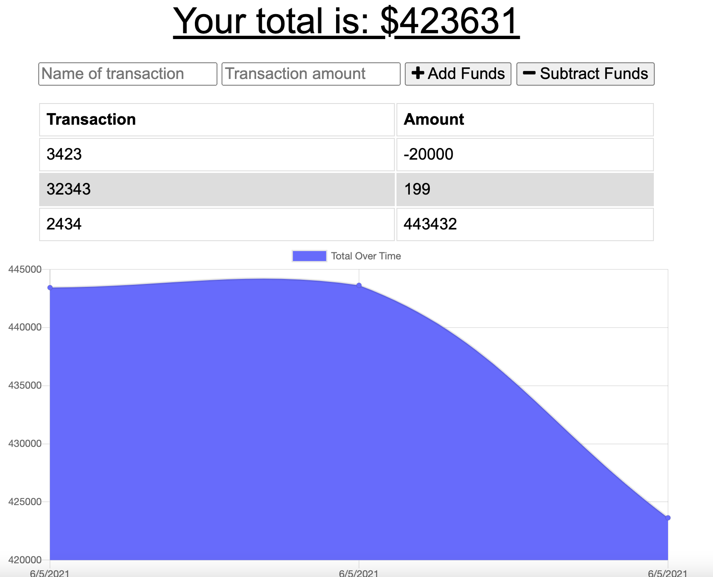

# Budget-Tracker

## Links:

### Repo:

https://github.com/chronoslou/budget-tracker

### Deployed:

https://progressive-budget-tracker-pwa.herokuapp.com/

## Description

This app gives users a fast and easy way to track their money is important, but allowing them to access that information anytime is even more important. This app adds functionality to an existing Budget Tracker application to allow for offline access and functionality.

## User Story

As an avid traveller, the users should be able to track my withdrawals and deposits with or without a data/internet connection so that the account balance is accurate when traveling. The user will be able to add expenses and deposits to their budget with or without a connection. When entering transactions offline, they should populate the total when brought back online.

Offline Functionality:

- Enter deposits offline
- Enter expenses offline

When brought back online:

- Offline entries should be added to tracker.

## Installation

## Preview of App

# Lincense

- MIT
